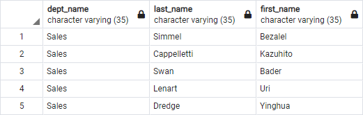
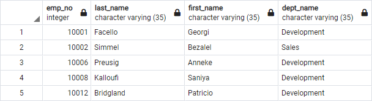

# EmployeeSQL
Design tables to hold data in the CSVs, import the CSVs into a SQL database, and answer questions about the data. Data Engineering and Data Analysis.

## Repository Structure
[Table Schema | Data Engineering](SQL/schema.sql)  

[Queries | Data Analysis](SQL/queries.sql)   

[Referenced Datasets](Data)   
##  
<p align="center">
  
</p>

## Objectives  
1. Use the information you have to create a table schema for each of the six CSV files.
2. Import each CSV file into the corresponding SQL table.
3. List employee number, last name, first name, sex, and salary.
4. List first name, last name, and hire date for employees who were hired in 1986.
5. List the manager of each department.
6. List the department of each employee.
7. List first name, last name, and sex for employees whose first name is “Hercules” and last names begin with “B.”
8. List all employees in the Sales department.

## Data Modeling (ERD)
<p align="center">
  
</p>

## Data Engineering 
Building out database with the ERD acting as a guide. Creating the ERD was the hard part, now it's time to plug everything together. Easy-peasy!
```SQL
-- Create Tables
-- Titles
CREATE TABLE "titles" (
    "title_id" CHAR(5) NOT NULL PRIMARY KEY,
    "title" VARCHAR(35) NOT NULL
);
-- Employees
CREATE TABLE "employees" (
    "emp_no" INTEGER NOT NULL PRIMARY KEY,
    "emp_title_id" CHAR(5) NOT NULL,
    "birth_date" DATE,
    "first_name" VARCHAR(35) NOT NULL,
    "last_name" VARCHAR(35) NOT NULL,
    "sex" VARCHAR(1),
    "hire_date" DATE,
    FOREIGN KEY (emp_title_id) REFERENCES titles(title_id)
);
-- Salaries 
CREATE TABLE "salaries" (
    "emp_no" INTEGER,
    "salary" FLOAT,
    FOREIGN KEY(emp_no) REFERENCES employees(emp_no)
);
-- Departments
CREATE TABLE "departments" (
    "dept_no" CHAR(4) NOT NULL PRIMARY KEY,
    "dept_name" VARCHAR(35) NOT NULL
);
-- Department Employees
CREATE TABLE "dept_emp" (
    "emp_no" INTEGER NOT NULL,
    "dept_no" CHAR(4) NOT NULL,
    FOREIGN KEY (emp_no) REFERENCES employees(emp_no),
    FOREIGN KEY (dept_no) REFERENCES departments(dept_no)
);
-- Department Managers
CREATE TABLE "dept_manager" (
    "dept_no" CHAR(4),
    "emp_no" INTEGER,
    FOREIGN KEY(emp_no) REFERENCES employees(emp_no),
    FOREIGN KEY(dept_no) REFERENCES departments(dept_no)
);

```
## Data Analysis 
Let's answer the questions we had from the Objectives section.
```SQL
-- QUERIES | DATA ANALYSIS
-- (1)List the following details of each employee: employee number, last name, first name, sex, and salary.
SELECT employees.emp_no, employees.last_name, employees.first_name, employees.sex, salaries.salary
FROM employees
JOIN salaries
ON employees.emp_no = salaries.emp_no;

-- (2)List first name, last name, and hire date for employees who were hired in 1986.
SELECT first_name, last_name, hire_date 
FROM employees
WHERE hire_date BETWEEN '1/1/1986' AND '12/31/1986'
ORDER BY hire_date;

-- (3)List the manager of each department with the following information: department number, 
-- department name, the manager’s employee number, last name, first name.
SELECT departments.dept_no, departments.dept_name, dept_manager.emp_no, employees.last_name, employees.first_name
FROM departments
JOIN dept_manager
ON departments.dept_no = dept_manager.dept_no
JOIN employees
ON dept_manager.emp_no = employees.emp_no;

-- (4)List the department of each employee with the following information: employee number, 
-- last name, first name, and department name.
SELECT dept_emp.emp_no, employees.last_name, employees.first_name, departments.dept_name
FROM dept_emp
JOIN employees
ON dept_emp.emp_no = employees.emp_no
JOIN departments
ON dept_emp.dept_no = departments.dept_no;

-- (5)List first name, last name, and sex for employees whose first name is “Hercules” and last names begin with “B.”
SELECT employees.first_name, employees.last_name, employees.sex
FROM employees
WHERE first_name = 'Hercules'
AND last_name Like 'B%'

-- (6)List all employees in the Sales department, including their employee number, 
-- last name, first name, and department name.
SELECT departments.dept_name, employees.last_name, employees.first_name
FROM dept_emp
JOIN employees
ON dept_emp.emp_no = employees.emp_no
JOIN departments
ON dept_emp.dept_no = departments.dept_no
WHERE departments.dept_name = 'Sales';

-- (7)List all employees in the Sales and Development departments, including their employee number, 
-- last name, first name, and department name.
SELECT dept_emp.emp_no, employees.last_name, employees.first_name, departments.dept_name
FROM dept_emp
JOIN employees
ON dept_emp.emp_no = employees.emp_no
JOIN departments
ON dept_emp.dept_no = departments.dept_no
WHERE departments.dept_name = 'Sales' 
OR departments.dept_name = 'Development';

-- (8)In descending order, list the frequency count of employee last names, i.e., how many employees share each last name.
SELECT last_name,
COUNT(last_name) AS "frequency"
FROM employees
GROUP BY last_name
ORDER BY COUNT(last_name) DESC;
```

## Results


 

 


 

 

 

 

## Pandas & SQLAlchemy 
W.I.P
